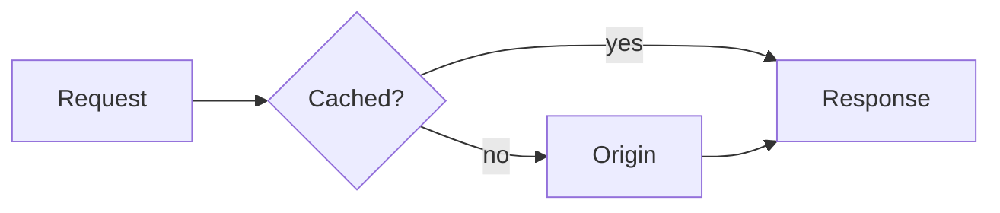

# Syntax and layout tricks

Exact snippets for functional markdown features beyond the basics. Decorative layout lives in [components.md](components.md). Support is noted per feature: **GH** GitHub, **GL** GitLab, **CM** any CommonMark renderer. Check the target renderer before using anything not marked CM.

## Contents

- [Collapsible sections](#collapsible-sections)
- [Alerts](#alerts)
- [Footnotes](#footnotes)
- [Anchors and internal links](#anchors-and-internal-links)
- [Reference links](#reference-links)
- [Inline extras](#inline-extras)
- [Diagrams and math](#diagrams-and-math)
- [Images](#images)
- [Spacing and escaping](#spacing-and-escaping)
- [What GitHub strips](#what-github-strips)

## Collapsible sections

GH, GL, most HTML renderers. The blank line after `</summary>` is required, or the markdown inside renders as raw text.

```html
<details>
<summary>Full list of environment variables</summary>

| Variable | Default |
|---|---|
| `PORT` | `3000` |

</details>
```

- `<details open>` expands by default.
- The summary should say what's inside, so a scanner can decide without opening it.
- Good for: long option lists, troubleshooting, legacy behavior, full output logs.
- Bad for: anything most readers need. Hidden content is skipped content.

## Alerts

GH, GL. Obsidian renders the same syntax as callouts. Elsewhere it degrades to a blockquote with a visible `[!NOTE]` line.

```markdown
> [!NOTE]
> Useful context a skimmer might miss.

> [!TIP]
> Optional advice that makes things easier.

> [!IMPORTANT]
> Required for success.

> [!WARNING]
> Needs attention to avoid problems.

> [!CAUTION]
> Risky or destructive consequences.
```

- Can't be nested inside lists or other blocks.
- One or two per section at most. Prefer `WARNING` and `NOTE`; the other three blur together for readers.

## Footnotes

GH, GL.

```markdown
79% of users scan a new page instead of reading it word by word.[^nng]

[^nng]: Nielsen Norman Group, "How users read on the web".
```

Footnotes render at the bottom of the file regardless of where the definition sits. Use them for sources and asides that would break the flow of a sentence.

## Anchors and internal links

GH, GL auto-generate an anchor for every heading: lowercase, spaces to `-`, punctuation dropped. `## Install the CLI` becomes `#install-the-cli`.

```markdown
See [Install the CLI](#install-the-cli).
See [the setup guide](docs/setup.md#prerequisites).
```

- Duplicate headings get `-1`, `-2` suffixes. Avoid duplicates rather than rely on this.
- Emoji and special characters in headings produce anchors like `#-install`. Another reason to keep headings plain.
- Custom anchor (GH): `<a id="readme-top"></a>` at the top, then `[back to top](#readme-top)` at the end of long sections.
- Relative file links (`docs/setup.md`) work on forks, branches and local clones. Absolute GitHub URLs don't.

## Reference links

CM. Keeps long URLs out of prose, so the raw source reads cleanly.

```markdown
Built on [CommonMark][cm] and rendered with [markdown-it][mdit].

[cm]: https://commonmark.org
[mdit]: https://github.com/markdown-it/markdown-it
```

## Inline extras

| Want | Syntax | Support |
|---|---|---|
| Keyboard keys | `<kbd>Ctrl</kbd>+<kbd>C</kbd>` | GH, GL |
| Subscript / superscript | `H<sub>2</sub>O`, `x<sup>2</sup>` | GH, GL |
| Small caption text | `<sub>Figure 1: request flow</sub>` | GH, GL |
| Strikethrough | `~~old~~` | GH, GL, most editors |
| Task list | `- [ ] todo` / `- [x] done` | GH, GL |
| Color swatch | `` `#0969DA` `` | GH issues, PRs, discussions only |
| Code containing backticks | ``` `` `code` `` ``` | CM |
| Hidden note | `<!-- note for editors -->` | CM |
| Mentions, issue refs | `@user`, `#123` | GH |

Underline (`<ins>`) exists on GH but reads like a link. Avoid it.

## Diagrams and math

GH, GL, Obsidian, Notion render Mermaid. Elsewhere it shows as a code block, which is still readable text.

````markdown

````

- Keep diagrams under ~15 nodes. A bigger one wants splitting.
- Label edges when the relationship isn't obvious.
- GH also renders ` ```geojson `, ` ```topojson ` (maps) and ` ```stl ` (3D models).

Math (GH, GL):

```markdown
Inline: $O(n \log n)$

$$
\sum_{i=1}^{n} i = \frac{n(n+1)}{2}
$$
```

When `$` clashes with prose like prices, use a ` ```math ` fence instead.

## Images

Plain markdown images have no size control. Use HTML when size matters (GH, GL):

```html

```

- Alt text says what the image shows, not "screenshot" or "image".
- GitHub blocks iframes. For video, link a thumbnail to it, or upload an `.mp4` through the GitHub web editor, which renders a player.
- Light/dark variants, floats, galleries and banners are in [components.md](components.md).

## Spacing and escaping

- Line break inside a paragraph: end the line with `\` or use `<br>`. Avoid two trailing spaces; they're invisible.
- Extra vertical space: `<br>` between blocks (GH). Prefer structure over spacing hacks.
- Indent without a code block: `&nbsp;` repeated. Rarely justified.
- Escape markdown characters with a backslash: `\*`, `\_`, `\#`, `\|`, `` \` ``.
- Colored text is impossible on GitHub. The closest portable option is a ` ```diff ` block (`+` green, `-` red) or a shields.io badge (see [badges.md](badges.md)).

## What GitHub strips

GitHub sanitizes HTML in markdown. Removed: `style` and `class` attributes, `<style>`, `<script>`, `<iframe>`, `<font>`, `<form>`, event handlers. Kept: `align`, `width`, `height` on images and block elements, `<details>`, `<summary>`, `<kbd>`, `<sub>`, `<sup>`, `<picture>`, `<source>`, `<br>`, `<a id>`, tables.

Other renderers differ. npm and PyPI allow less; Discord, Slack and Notion show HTML tags as literal text. When unsure, preview on the target platform.
